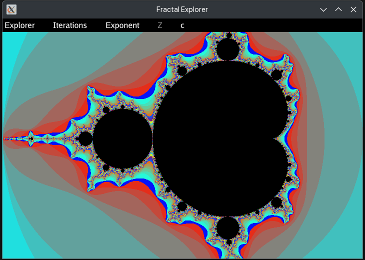
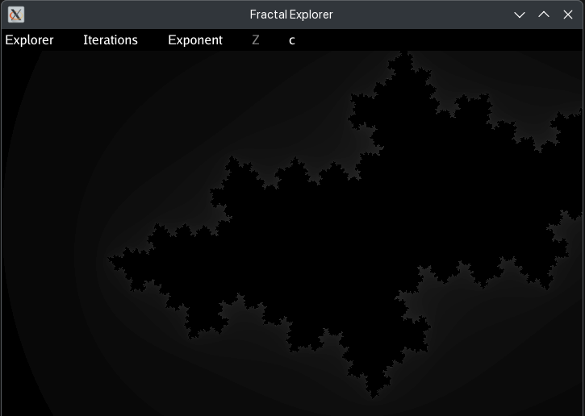

# Mandelbrot

A playground for exploring Mandelbrot and other fractals.

```bash
go run github.com/USA-RedDragon/mandelbrot@main
```

## Configuration

You can set each option in a YAML config file, with an environment variable,
or with a command-line flag. A flag wins over an environment variable, which
wins over the config file, which wins over the default.

The config file is `config.yaml` in the current directory. If it is missing,
the defaults are used. Use `-c` or `--config` to pick a different file.
See [config.example.yaml](config.example.yaml) for an example.

Complex numbers are written like `-0.63+0.34i`, `(-0.8+0.156i)`, `2` or `1i`.

```bash
go run github.com/USA-RedDragon/mandelbrot@main --julia --c="(-0.8+0.156i)"
```

<!-- configulator:begin -->

| Key              | Type    | Default         | Environment      | Flag               | Description                           |
|------------------|---------|-----------------|------------------|--------------------|---------------------------------------|
| `log-level`      | string  | `info`          | `LOG_LEVEL`      | `--log-level`      | log level: debug, info, warn or error |
| `width`          | integer | `720`           | `WIDTH`          | `--width`          | initial window width                  |
| `height`         | integer | `480`           | `HEIGHT`         | `--height`         | initial window height                 |
| `max-iterations` | integer | `1000`          | `MAX_ITERATIONS` | `--max-iterations` | maximum iterations per point          |
| `scale`          | number  | `1`             | `SCALE`          | `--scale`          | initial zoom scale, smaller zooms in  |
| `center`         | string  | `0`             | `CENTER`         | `--center`         | initial view center                   |
| `exponent`       | string  | `2`             | `EXPONENT`       | `--exponent`       | exponent in z = z^exponent + c        |
| `z`              | string  | `0`             | `Z`              | `--z`              | starting z for the Mandelbrot set     |
| `c`              | string  | `(-0.63+0.34i)` | `C`              | `--c`              | c for the Julia set                   |
| `julia`          | boolean | `false`         | `JULIA`          | `--julia`          | start in Julia set mode               |
| `palette`        | string  | `rainbow`       | `PALETTE`        | `--palette`        | color palette: rainbow or grayscale   |

<!-- configulator:end -->

## Screenshots


